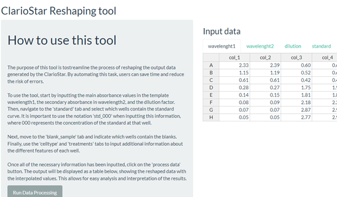

Ah, the sweet satisfaction of completing a (mini) project. Today, I publish my first R Shiny app. It is just a simple tool to automate data analysis for my colleagues and it took me  half a day, so I'm quite proud. But let's be honest, working with Shiny is sometimes a walk in the park. In fact, at times, it can feel like you're walking through a dense forest with no clear path in sight.
Don't get me wrong, I love R, and I think it's an incredibly powerful language. But when it comes to Shiny, things can get convoluted. What could be achieved with a few lines of code in other languages often requires function after function after function in Shiny. And don't even get me started on the need to wrap everything in reactive() functions. It's like trying to find your way through a labyrinth while blindfolded.
However, despite these frustrations, I must admit that the end result is worth it. Shiny is incredibly powerful and can do amazing things. It just takes a little extra effort and patience to get there. Just take a look at the picture:

If you're struggling with Shiny, know that you're not alone. It's a tricky beast to tame, but with a bit of perseverance, you'll get there. And when you finally do, the feeling of accomplishment is like no other.
So, to all the Shiny users, keep pushing through the frustration. The end result is worth it. And to our friend who just published their first Shiny app, congratulations! We're all cheering you on and can't wait to see what other amazing things you'll create in the future.
For those who want to check out our friend's shiny app and repo, be sure to follow the link they provided. Who knows, maybe it will inspire you to create your own Shiny masterpiece.
Link to the app [here](https://phisanti.shinyapps.io/elisa_analiser/)
Link to the repo [here](https://github.com/phisanti/elisa_analiser)

PS, Also, I am working in a bigger Shiny project, so stary tune for the news.
