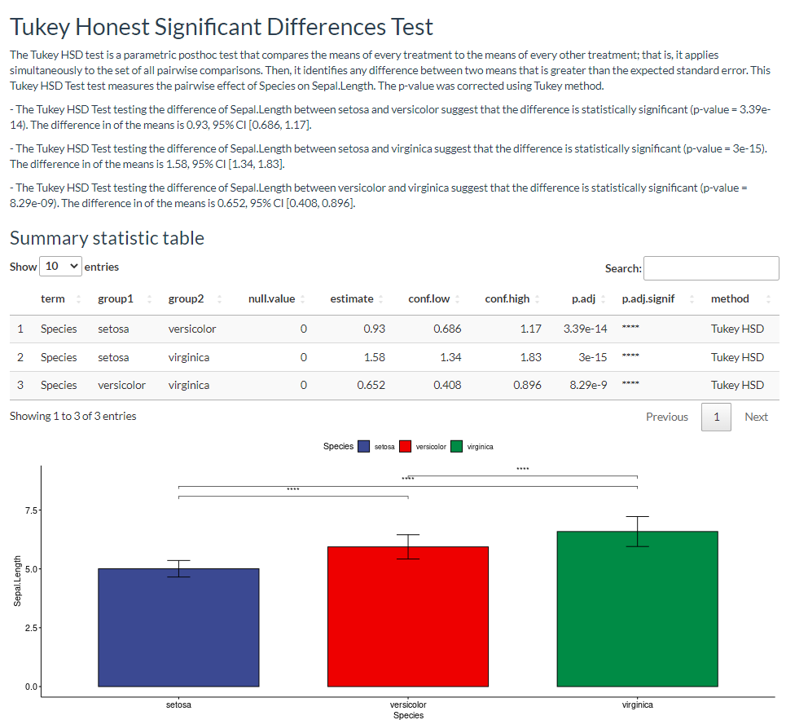

Shiny strikes back. A little bit over three weeks after publishing my first Shiny app, here comes my new creation freePrism! This app was inspired by the statistical analysis software Prism. The idea was to provide a GUI tool to my colleagues so that they could perform basic statistical analysis with relative ease. In the app, I included tools to run a two-sample comparison, one-way and two-way ANOVA and linear regression models. In addition, it is also possible to produce ready-made plots to show the statistical contrast for publication and download them as PDFs in case it is necessary to keep working on them. 
The app is neatly organized with different tabs for each statistical test, making it user-friendly and straightforward. All you have to do is input the test arguments and upload your data. Once you hit "run analysis," the app generates a written report and a summary table. And if you're not satisfied with the analysis, you can continue to produce different types of plots.
Take a look at these p-values:

But let's take a moment to appreciate the magic behind the scenes - R is lifting all the weight. However, instead of using the ELISA analyzer, this time, I went with the Golem framework. The beauty of this framework is that the app is an R package, making it easier to split the different parts into auxiliary functions. Plus, the app is organized into separate modules. Shiny modules can be tricky at first, but you'll get used to them. One thing that still amuses me about Shiny is that to pass reactive objects between modules; you have to pass them as functions! Why am I surprised when everything in R is a function?
In conclusion, you can find the app at [free-prism](https://phisanti.shinyapps.io/free-prism/), or you can check out the code directly at [my github](https://github.com/phisanti/freePrism). And because the app is an R package, you can even install it on your local device and try it out for yourself. Happy coding, everyone!